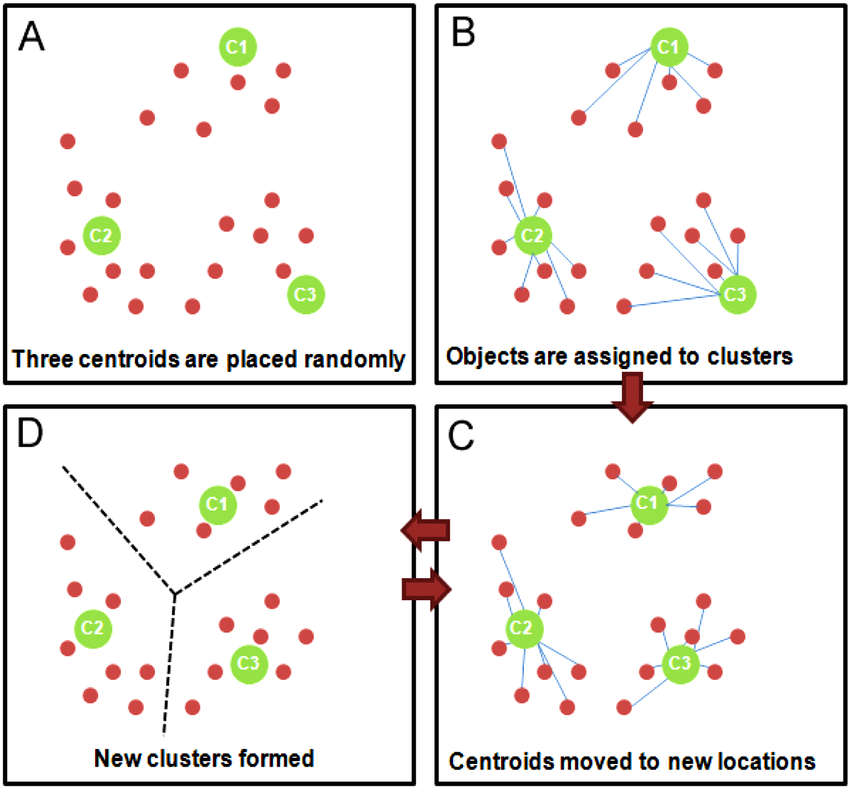
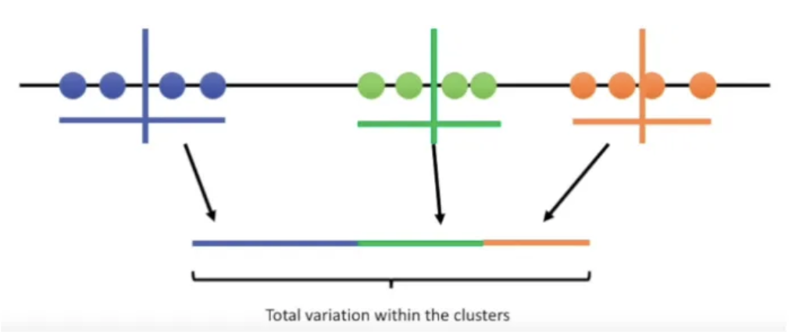
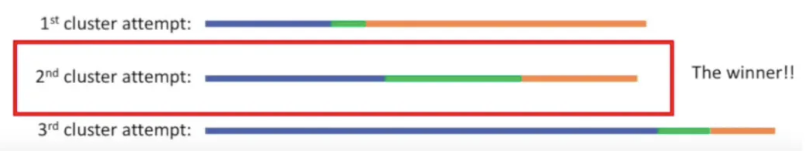
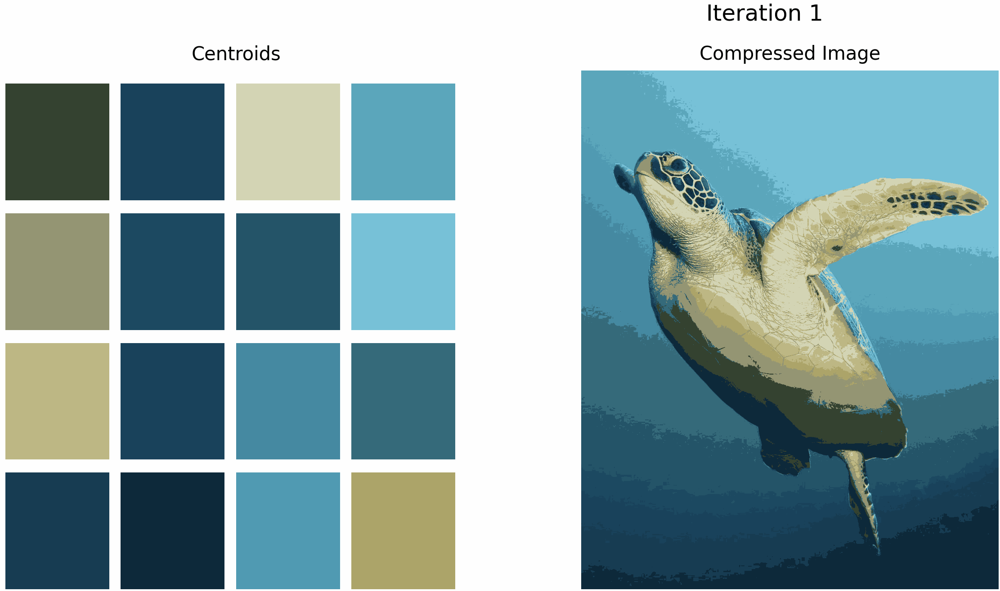
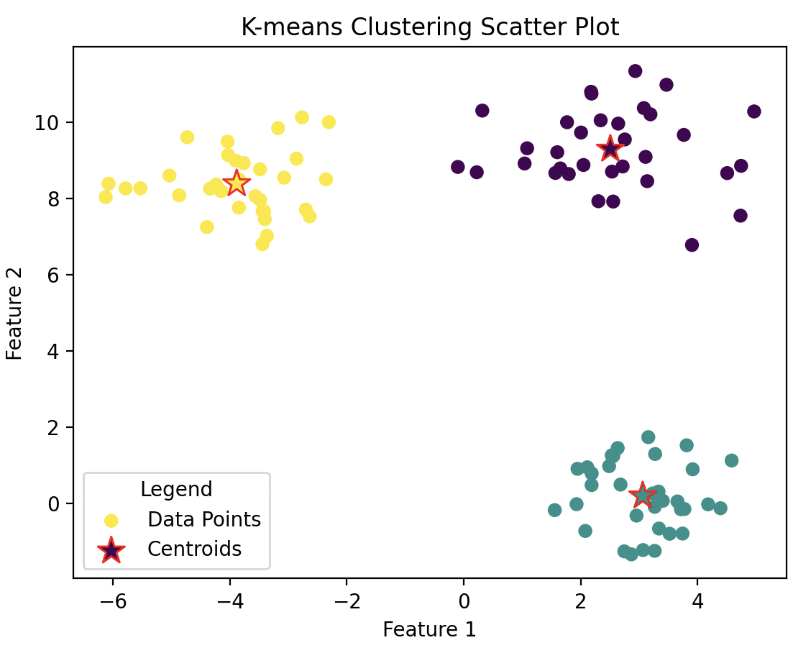

*The Roux Institute at Northeastern. DS5020 Spring 2024 Project.* 
# K-Means Clustering Tutorial
## Table of Contents
* [What is K-Means Clustering?](#what-is-k-means-clustering)
* [The Step-By-Step Process](#the-step-by-step-process)
* [Pros and Cons](#pros-and-cons)
* [Real-World Applications](#real-world-applications)
* [K-Means Code Implementation](#k-means-code-implementation)
* [Conclusion](#in-conclusion)
* [References/Acknowledgements](#referencesacknowledgements)

## What is K-Means Clustering?
K-means clustering is a popular algorithm used for grouping a set of data points into “K” number of distinctive clusters. It starts off by choosing “K” number of cluster centers (known as the *centroids*), and then assigns each data point to the nearest centroid, usually based on the Euclidean distance. After that, the centroids are recalculated and updated to the mean position of all the data points assigned to each respective cluster (the new centroid position is the average coordinate of all points in the cluster). Once that occurs, the same steps (assigning data points and re-updating centroids) repeat iteratively until either the maximum set number of iterations is reached, or the centroids no longer change significantly indicating that the means have stabilized. The goal of a successful k-means is to minimize the sum of squared distances (SSE), which represents the within-cluster variance, between the data points and their respective centroids. Having a good "within-cluster" variance means that that clusters are compact, indicative of a "good" k-means outcome. If the centroids stop changing significantly, it indicates that a local minimum has been reached. The end result is a set of K-clusters, each characterized by their centroids. The choice of features and their dimensionality can also significantly impact the clustering results, as they determine the calculation of distances between data points in the feature space.  For example, using irrelevant features can lead to inaccurate clustering, while techniques such as feature scaling can help improve clustering performance (the algorithm can perform better or converge faster if the features are on a similar scale and close to normally distributed).

    

 

## The Step-By-Step Process
### Step 1: *Generating Initial Centroids*
After preparing the data and selecting the "K" number of clusters and max iterations, "K" initial centroids will be randomly generated. There are actually different way used in industry today which can help determine an optimal "K" such as the [elbow method](https://en.wikipedia.org/wiki/Elbow_method_(clustering)) or the [silhouette method](https://www.geeksforgeeks.org/silhouette-algorithm-to-determine-the-optimal-value-of-k/). However, for the basic K-means algorithm and for the purposes of this project, we will be choosing "K" arbitrarily.

### Step 2: *Data Point Assignment*
Assigning each data point to the nearest centroid, usually based on Euclidean distance (straight-line distance between two points in the feature space). Using the Euclidian distance for the distance calculation is the most straightforward and common method, however, in cases where it might be less effective, other methods such as the [Manhattan distance](https://en.wikipedia.org/wiki/Taxicab_geometry) or [Cosine similarity](https://en.wikipedia.org/wiki/Cosine_similarity) can be used depending on factors such as the nature of the features (you might have non-numeric data), non-uniformly scaled features, or outliers (Euclidean distance can be particularly sensitive to outliers due to the absolute differences).

### Step 3: *Updating the Centroids*
The centroids are recalculated and updated to the mean position of all the data points assigned to each respective cluster.

### Step 4: *Reiterating Steps 2 and 3*
The same steps (assigning data points and re-updating centroids) are repeated iteratively until either the maximum set number of iterations is reached, or the mean calculations have stabilized (this is also sometimes called *convergence*).

    

 

### Step 5 (optional): *Assess Results with Within-Cluster Variance*
You can get the within-cluster variance by calculating the sum of the squared distances (SSE) from each point to its assigned centroid. For a "good" K-means outcome, you want this sum to be low.

    

 

### Step 6 (optional w/ Step 5): *Repeat Steps 1-5 Until Best Results*
The K-means clustering algorithm can’t tell if a clustering is good or not, furthermore, the quality is highly dependent upon the initial centroids. Therefore, it is considered good practice to do everything all over with different starting points, and keep track of their total variance. You ultimately want to reach the lowest sum of variance by choosing the best run.

    

 

## Pros and Cons
### *Pros:*
* The algorithm itself is simplistic and versatile, making it a very popular choice for clustering.
* The results are easy to interpret, especially when the number of clusters is small. This makes it a great go-to clustering option.
* Computationally, it is very efficient, so it is able to handle large data sets with ease.
* Depending on the data, it can even be used for clustering in higher dimensional spaces. Basically, it can easily be scaled to a large number of samples and features.

### *Cons:*
* There is often uncertainty in knowing which “K” to choose for the most optimal solution. Despite different methods for finding this value, it is hard to say that there is a "best method" for answering this question.
* The results are quite sensitive to the initial centroids. Furthermore, any data point outliers will also significantly impact the results due to the mean calculations.
* This algorithm also assumes that the clusters will be spherical in shape and similar size (it assumes that the variance within each cluster is similar along all dimensions), meaning that this algorithm might not perform well with certain types of data.

All in all, K-means clustering can be an excellent choice in multiple fields as long as it is chosen intentionally with the data’s characteristics in mind.

## Real-World Applications
Due to its simplicity and versatility, K-means clustering has numerous real-world applications including:
* Pattern recognition (such as finding similar gene groups in the field of genetics, or doing social network analysis)
* Outlier identification (such as fraud detection)
* Grouping based on characteristics (such as grouping people based on traits or documents based on text)
* Image compression (refactoring an image file in a way that takes up less storage space)
    * This is one of the more well-known uses of K-means clustering. Essentially, this is done by using K-means to group similar colors together, thus reducing the total number of colors in the image while effectively maintaining the visual quality upon compression. You can see the gif below as an example!
    * For those who want to try this in real life, an interesting implementation of image compression using the k-means algorithm can be found in the GitHub repository [here](https://github.com/preetmishra/image-compression-kmeans)

    

 

## K-Means Code Implementation
To view and run our k-means code implementation, please open the `kmeans.py` script included in the submission! 

Our k-means code was basically split up into 4 separate functions that worked together to create the main `kmeans()` function.
1. Function `make_centroids(k, datapoints)` generates centroids within the max/min of the dataset
2. Function `get_distance(data_point, centroids)` calculates the Euclidean distance between a data point and all centroids.
3. Function `assign_clusters(data_points, centroids)` assigns each data point to the nearest centroid based on the Euclidean distance calculated in with function `get_distance(data_point, centroids)`.
4. Function `update_centroids(data_points, cluster_labels, centroids)` does the centroid updating based on the mean of data points assigned to each cluster. Together, function 2, 3, and 4 complete the iterating step used in the actual k-means algorithm.
5. Finally, putting everything together, the `kmeans(data_points, k=3, iterations=300)` runs the actual k-means algorithm, making use of all the previous functions. The number of k-clusters and iterations can be adjusted with the parameters. Furthermore, there is a conditional within the iterative loop to stop the iterations if the centroids stop changing. The script itself is set to have 2 features (2 dimensions in the array) because it is easier to view a 2-dimensional scatter plot. Due to the random data points created in the `main()`, the generated scatter plot will be different every time, however, in general, the generated figure will look something like this:

    

 

*Note: Our implementation also makes use of sklearn's `make_blobs()` function when generating the synthetic data. This generates isotropic Gaussian blobs for clustering which makes it easier to distinguish the clusters in the final scatter plot image. However, this addition is not actually necessary for the implementation to work (it was an aesthetic choice).*

## In Conclusion...
The overall performance of the K-means clustering may not be as competitive as some of the other intricate methods out there, but despite its shortcomings, this simple and elegant algorithm is still extensively used in data cluster analysis today and may even be the best option depending on what dataset you are trying to analyze!

## References/Acknowledgements
#### Online/Academic References:
* Ahmed, M., Seraj, R., & Islam, S. M. (2020). The K-Means Algorithm: A comprehensive survey and performance evaluation. Electronics, 9(8), 1295. ([link](https://doi.org/10.3390/electronics9081295))
* VanderPlas, J. (2016, November). In depth: K-means clustering | python data science handbook. jakevdp.github.io/PythonDataScienceHandbook/. ([link](https://jakevdp.github.io/PythonDataScienceHandbook/05.11-k-means.html))
* (LEDU), E. E. (2018, September 12). Understanding K-means clustering in machine learning. Medium. ([link](https://towardsdatascience.com/understanding-k-means-clustering-in-machine-learning-6a6e67336aa1))
* Banoula, M. (2023, April 13). K-means clustering algorithm: Applications, types, and demos [updated]: Simplilearn. Simplilearn.com. ([link](https://www.simplilearn.com/tutorials/machine-learning-tutorial/k-means-clustering-algorithm#disadvantages_of_kmeans))
* Mahajan, A. (2020). Image compression using K-means clustering. University at Buffalo CSE 633. ([link](https://cse.buffalo.edu/faculty/miller/Courses/CSE633/Aashna-Mahajan-Spring-2020.pdf))
* The Elbow Method - [link](https://en.wikipedia.org/wiki/Elbow_method_(clustering))
* The Silhouette Method - [link](https://www.geeksforgeeks.org/silhouette-algorithm-to-determine-the-optimal-value-of-k/)
* Manhattan Distance - [link](https://en.wikipedia.org/wiki/Taxicab_geometry)
* Cosine Similarity - [link](https://en.wikipedia.org/wiki/Cosine_similarity)

#### Video References:
* K-Means Clustering: How it Works - [link](https://www.youtube.com/watch?v=_aWzGGNrcic )
* StatQuest: K-Means Clustering - [link](https://www.youtube.com/watch?v=4b5d3muPQmA)
* K-Means Clustering in Python - [link](https://www.youtube.com/watch?v=5w5iUbTlpMQ&t=600s)

#### Image References:
* [K-means_before/after image](https://www.analyticsvidhya.com/blog/2021/04/k-means-clustering-simplified-in-python/)
* [K-means steps image](https://www.researchgate.net/profile/Rumdeep-Grewal-2/publication/276494113/figure/fig2/AS:391847961743364@1470435242664/K-means-clustering-A-Starting-with-three-randomly-placed-centroids-green-B-Next.png)
* [Within-cluster variance image](https://miro.medium.com/v2/resize:fit:1400/format:webp/1*R5OGSJ3ftrqzaMGEgGu0Lw.png)
* [Best cluster variance image](https://miro.medium.com/v2/resize:fit:1400/format:webp/1*n9ButwNY935SrcyZD8Fbrg.png)
* [Image compression gif](https://towardsdatascience.com/clear-and-visual-explanation-of-the-k-means-algorithm-applied-to-image-compression-b7fdc547e410)

#### Acknowledgements:
Special thanks to Professor Weston Viles and TA Nelson Farrell for such a warm and enlightening semester!